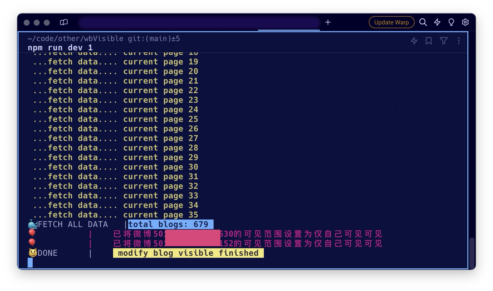
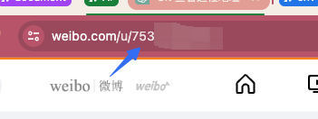
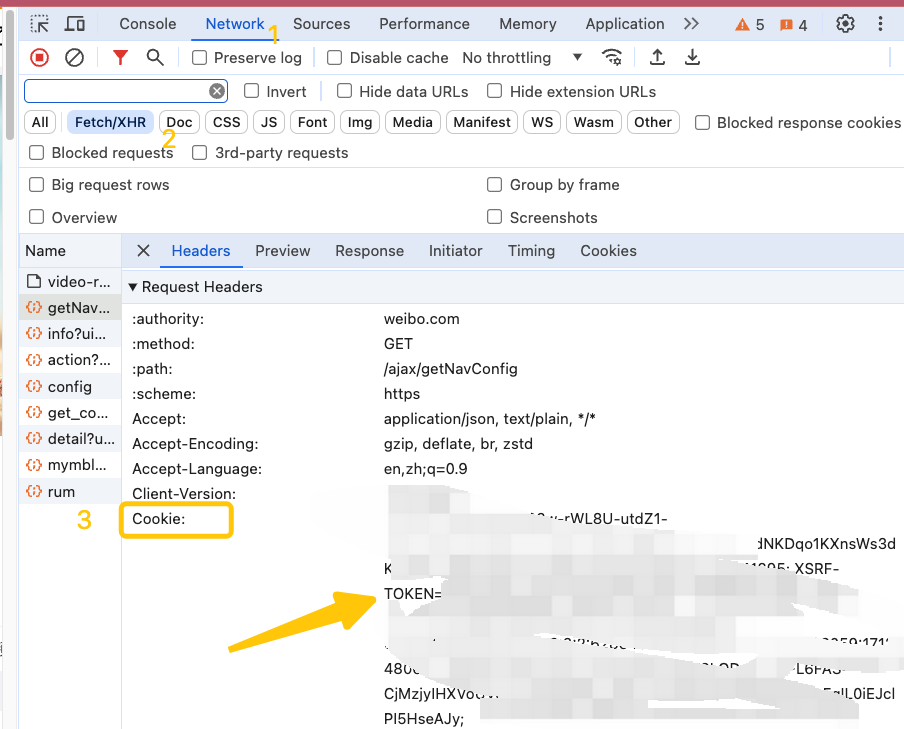

## Usage

- nodejs 版本需要在 16 以上

- git clone

- 本地新增.env 文件

  ```
  UID=xxx
  COOKIE=xxx
  ```

  UID：个人主页链接的最后一串数字
  COOKIE: 右键打开控制台随便打开一个 fetch 请求，复制请求头中的 cookie 值

## running

- install

  ```
  npm install
  ```

- run

  > visible 为变量,可设置为<0|1|2>
  > 0:公开,1:自己可见,2:好友圈可见，默认为 2
  > 例：npm run dev 1 (将所有博客都设置为自己可见)

  ```
  npm run dev <visible>
  ```
